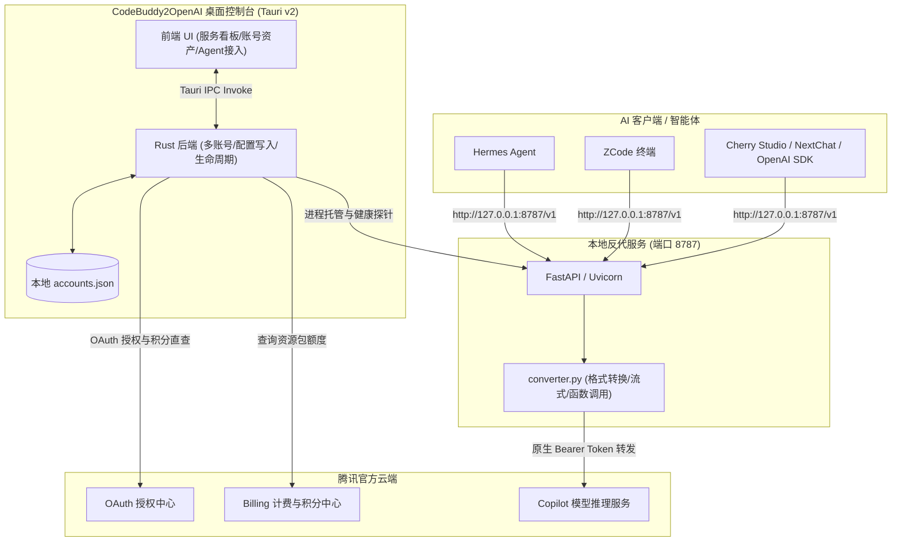

<div align="center">

# 🚀 CodeBuddy2OpenAI

### 独立桌面控制台 · WorkBuddy 转 OpenAI 兼容端点 · 多账号资产管理 · Agent 接入引导

[](LICENSE)
[](https://github.com/3304711297/codebuddy2openai)
[](https://tauri.app/)
[](https://www.python.org/)

<p align="center">
  <b>无需下载或安装原版腾讯 WorkBuddy 客户端</b>，直接在浏览器中完成网页授权，<br/>
  将腾讯代码助手能力转换为标准的 <code>OpenAI /v1/chat/completions</code> 接口，供日常各类 AI 编程助理极速调用！
</p>

</div>

---

## ✨ 核心特性

- 🖥️ **独立现代化桌面 GUI (Tauri v2 + 原生深色设计)**：提供直观的服务看板、端口设置、实时延迟测试与状态指示。
- 🔑 **无需安装原版 WorkBuddy**：集成浏览器 OAuth 授权全自动轮询流程，直接扫码/验证码登录获取凭据。
- 👥 **多账号管理与切换**：凭据统一持久化于本地数据库，支持一键切换活跃账号、手动刷新 Token 与账号删除。
- 📊 **内嵌真实积分资产看板**：逆向对接腾讯官方计量计费接口，实时掌握账户剩余积分、使用进度条及资源包配额明细。
- 🤖 **Agent 智能体接入引导（只读，不改写客户端配置）**：
  - **Hermes Agent**：提供推荐配置项与一键复制，按说明在 Hermes 的 `config.yaml` 中手动填写（供应商 + 模型别名）。
  - **ZCode**：ZCode Desktop 的供应商列表只认界面内添加，因此采用**引导式接入**——展示接口地址/密钥/模型清单，点击任意值即复制，在 ZCode Desktop → 模型设置 → 添加供应商 中粘贴即可。
  - ZCode 状态徽章基于本地服务端口的真实可达性探测，如实反映服务在线/离线。
- ⚡ **动态模型矩阵**：模型清单**自动获取 WorkBuddy 支持的全量模型**（含计费倍率、上下文窗口与思考强度配置），随上游动态更新，无需随版本维护静态列表；在「模型与接口」页面查看与定制。
- 🛡️ **安全脱敏支持**：内置 `--desensitize` 敏感词处理机制，避免系统提示词误触发安全风控拦截。

---

<details>
<summary><h2>📐 系统架构与工作流（点击展开）</h2></summary>



</details>

---

## 🚀 快速开始

### 方式一：直接运行桌面客户端（推荐）

双击桌面生成的 **`CodeBuddy2OpenAI`** 快捷方式，或直接运行发布产物：
```bash
src-tauri/target/release/codebuddy2openai.exe
```

1. **授权登录**：进入「授权新账号」页面，点击开始授权，浏览器将自动唤起腾讯登录页，完成授权后客户端自动保存凭据并切到账号面板。
2. **启动服务**：在「服务看板」点击「启动服务」，本地将监听 `http://127.0.0.1:8787`。
3. **Agent 接入引导**：进入「Agent 智能体接入引导」页面——Hermes 与 ZCode 均点击「如何手动接入」，查看推荐配置项与逐项可复制的值，再到对应客户端内按需填写（本工具不改写任何客户端配置文件）。

---

### 方式二：本地构建与源码调试

#### 环境要求
- Node.js 24+ 与 npm
- Rust 1.77+ 与 Cargo
- Python 3.10+（需安装依赖 `httpx fastapi uvicorn[standard]`）

```bash
# 1. 克隆本项目
git clone https://github.com/3304711297/codebuddy2openai.git
cd codebuddy2openai

# 2. 安装前端依赖并构建
npm install
npm run build

# 3. 运行 Tauri 开发模式或构建 Release 版本
cd src-tauri
cargo tauri dev       # 调试模式
cargo tauri build --no-bundle   # Release 编译
```

---

## ⚙️ 模型支持说明

支持的模型清单**自动获取 WorkBuddy 支持的模型**：启动服务后，控制台「模型与接口」页面会自动从 WorkBuddy 官方后端拉取全量模型矩阵，包含每个模型的计费倍率、上下文窗口上限与思考强度档位，并支持在页面内定制（修改上下文窗口、调节/关闭思考强度）。

模型集合随上游动态变化，本文档不再维护静态清单；以「模型与接口」页面实时展示的列表为准。

---

## 💻 客户端接入示例 (Python SDK)

```python
from openai import OpenAI

# 本地 CodeBuddy2OpenAI 端点
client = OpenAI(
    base_url="http://127.0.0.1:8787/v1",
    api_key="local" # 本地模式固定填写 local
)

response = client.chat.completions.create(
    model="glm-5.3-flash",
    messages=[
        {"role": "user", "content": "你好，请用 Python 写一个支持并发的安全队列。"}
    ],
    temperature=0.7
)

print(response.choices[0].message.content)
```

---

## 🛡️ 深度加固与高级特性

- **WSL 宿主凭据环境自适应（零配置穿透）**：
  在 Linux / WSL 环境下运行内核时，自动探测并挂载 Windows 宿主已登录的桌面端凭据（`CodeBuddyExtension/Data/Public/auth`）与多账号配置（`accounts.json`），免参数无感工作；亦可通过 `--wsl` 显式强制开启。
- **流式 tool_calls 损坏防御机制（解决 upstream Issue #3）**：
  针对腾讯后端在 `stream=true` 且模型生成 `tool_calls` 时偶发分片损坏（`function.name` 为空或 arguments 乱码残缺）导致 Claude Code / Codex / DeepSeek Harness 等 Agent 陷入死循环的硬伤，内核内建聚合校验与自动损坏重试，并通过标准平滑伪流式下发，彻底保障 Coding Agent 的调用稳定性。普通纯文本对话保持 100% 原始零延迟直通。
- **`X-Device-Token` 设备风控头（Turing Shield SDK 集成）**：
  内核对腾讯后端的请求会注入设备风控头 `X-Device-Token`，来源是本机已安装 WorkBuddy 桌面端自带的 Turing Shield SDK（`turing_helper.cjs` 自动发现 + 零宽空格脱敏等合规处理协同降低风控误判）。SDK 取不到时自动降级为不带该头，功能不受影响。

  **SDK 自动发现的搜索范围（供应链加固说明）**：
  1. 环境变量 `WORKBUDDY_TURING_SDK_DIR` —— 用户显式指定（最高优先级，指向 turing-sdk 目录或桌面端安装基目录均可）；
  2. `%LOCALAPPDATA%` / `%APPDATA%` / `%ProgramFiles%` / `%ProgramFiles(x86)%` / `%USERPROFILE%` / `%HOME%` 下的 `WorkBuddy` / `workbuddy` 安装目录（严格特征校验：`index.cjs` 入口 + `turing_sdk.node` 原生模块且 `package.json` 含 turing 标识，或官方 `TuringShieldSDK.dll`）；
  3. **各磁盘根目录（如 `D:\WorkBuddy`）默认不扫描** —— 这是刻意为之的安全设计：目录名巧合或被植入伪造 SDK 时，宽松扫描 + 直接 `require` 会构成本地代码执行风险。若你的桌面端安装在盘根等非常规位置，请显式设置环境变量后重启本客户端：
     ```powershell
     setx WORKBUDDY_TURING_SDK_DIR "D:\workbuddy"
     ```
     设置后新启动的进程生效；SDK 校验仍会验证入口文件与特征，仅放宽"用户显式信任"的路径来源。

---

## 🤝 致谢与声明

- 本项目基于 [HanHan666666/codebuddy2openai](https://github.com/HanHan666666/codebuddy2openai) 进行深度二次开发与架构重构。
- 架构设计深度借鉴了优秀开源项目 [EasyCLIProxyAPI](https://github.com/router-for-me/EasyCLIProxyAPI) 的桌面端实践思路。
- 以下功能借鉴自社区衍生项目 [xiaofan6ya/workbuddy2api](https://github.com/xiaofan6ya/workbuddy2api) 及其增强分支 [DistPub/workbuddy2api](https://github.com/DistPub/workbuddy2api)（均 MIT 开源）：
  - **`X-Device-Token` 设备风控头注入**（借鉴 xiaofan6ya 版）：通过桌面端自带 Turing Shield SDK 取设备 token，`turing_helper.cjs` 自动发现安装位置，降低敏感请求被上游风控识别的概率；
  - **流式 reasoning 合并器与空 delta 清洗**（借鉴 DistPub 版）：网关层把零散 reasoning 分片合并为一段再释放，剥离混入 `tool_calls` 参数流的推理内容，避免 AI SDK 出现大量碎片 Thought 块与工具参数 JSON 截断（移植时已修复其上游「键不存在被误判为空串导致纯 reasoning 帧被删」的缺陷）；
  - **脱敏词表扩张**（借鉴 DistPub 版）：补充竞争品牌词（Claude/Anthropic/OpenAI/Gemini/Kimi/Qwen/Cursor 等），脱敏覆盖角色扩展至 `assistant` 历史回复；
  - **每日签到**（端点逆向成果参考两仓库）：`/v2/billing/meter/daily-checkin` 链路，本项目按自身定位实现为 GUI 手动按钮触发，不做自动定时签到。
- 以下功能与架构思路借鉴自活跃衍生项目 [IceeAn/codebuddy2api](https://github.com/IceeAn/codebuddy2api)（当前重写树为 MIT 开源）：
  - **Claude 客户端指纹脱敏与精准改写层（P0 已落地）**：借鉴其对已知客户端特征句做中性改写的思路（`_rewrite_known_fingerprints`），改写 Claude Code 身份短语、移除 `x-anthropic-billing-header:` 等触发源，彻底解决上游 11128 安全策略拦截；
  - **多凭证轮换与活跃会话架构思路（P1 储备）**：参考其凭据生命周期感知与平滑轮换设计，待多账号就绪后按需引入。
- 本工具仅供个人学习、技术研究与工作流效率提升使用，请妥善保管个人授权凭据，遵循腾讯云相关产品服务协议。

---

## 📄 开源许可证

本项目基于 [MIT License](LICENSE) 开源。

本仓库包含从 [xiaofan6ya/workbuddy2api](https://github.com/xiaofan6ya/workbuddy2api)、[DistPub/workbuddy2api](https://github.com/DistPub/workbuddy2api) 与 [IceeAn/codebuddy2api](https://github.com/IceeAn/codebuddy2api)（均 MIT）移植或借鉴的代码，其版权声明、借鉴范围与移植差异详见 [THIRD_PARTY_NOTICES.md](THIRD_PARTY_NOTICES.md)。
