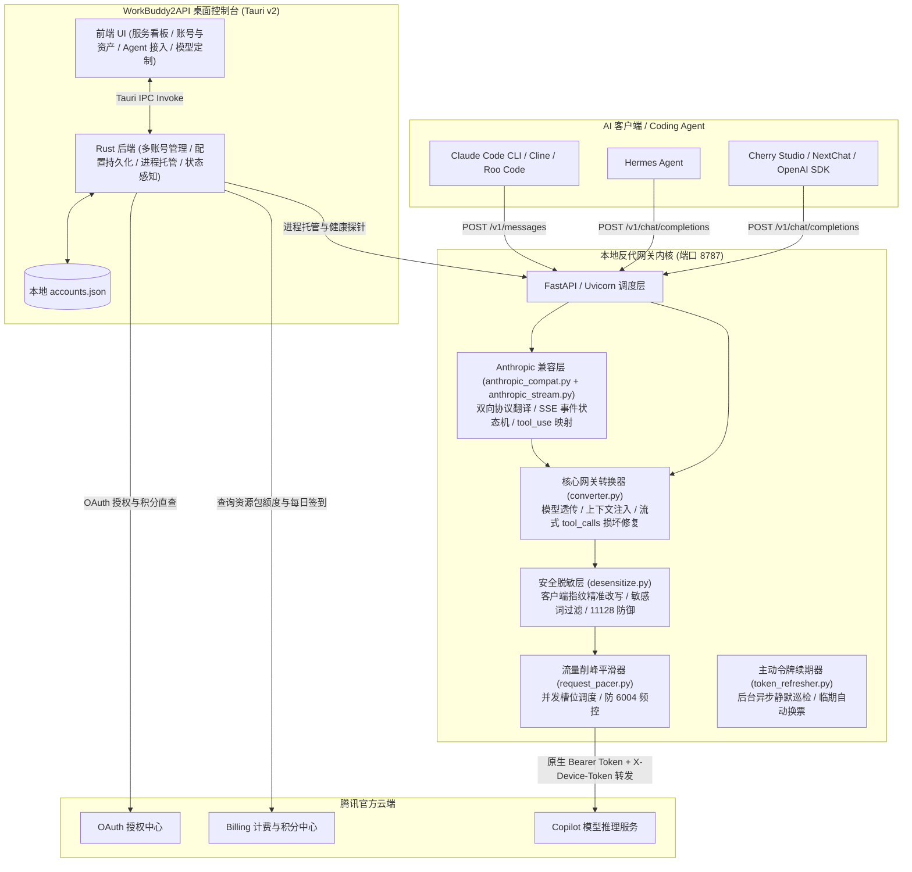

<div align="center">

# 🚀 WorkBuddy2API

### 独立桌面控制台 · WorkBuddy 转 OpenAI / Anthropic 双协议 API 网关 · 多账号资产管理 · Coding Agent 接入引导

> **说明**：本项目原名 `codebuddy2openai`。随着架构全面升级并原生支持 **Anthropic Messages (`/v1/messages`)** 协议，本项目已正式更名为 **WorkBuddy2API**，提供兼顾 OpenAI 与 Anthropic 两大主流生态的统一本地 API 网关。

[](LICENSE)
[](https://github.com/3304711297/workbuddy2api)
[](#-核心接口与协议速查)
[](https://tauri.app/)
[](https://www.python.org/)

<p align="center">
  <b>无需下载或安装原版腾讯 WorkBuddy 客户端</b>，直接在浏览器中完成网页授权，<br/>
  将腾讯代码助手能力转换为标准的 <code>OpenAI (/v1/chat/completions)</code> 与 <code>Anthropic (/v1/messages)</code> 双协议接口，<br/>
  原生直连驱动 <b>Claude Code CLI</b>、<b>Hermes Agent</b>、<b>Cline</b>、<b>Roo Code</b>、<b>Cherry Studio</b> 等各类主流 Coding Agent 与开发工具！
</p>

</div>

---

## ✨ 核心特性

- 🔄 **原生三协议网关支持 (Tri-Protocol Gateway)**：
  - **OpenAI Responses 协议 (`POST /v1/responses`)**：采用解耦模块设计（`responses_compat.py` 请求双向转换与 Responses 语义事件流状态机），原生支持 **Codex CLI**（wire_api="responses"）、OpenCode 等长上下文 Agent，支持流式语义事件与非流式响应；内建 **Codex 长上下文最小语义闭包投影压缩 (`responses_projection.py`)**，自动剥离 harness 模板、收敛工具 schema 与折叠早前历史，节约 60%~85% 显存/Token 并大幅规避内容审查误拦。
  - **Anthropic Messages 协议 (`POST /v1/messages`)**：采用解耦模块设计（`anthropic_compat.py` 请求响应双向翻译、`anthropic_stream.py` SSE 事件状态机），原生直连驱动官方 **Claude Code CLI**、Cline、Roo Code 等工具，支持流式输出与函数调用（tool_use）。
  - **OpenAI 对话补全端点 (`POST /v1/chat/completions`, `GET /v1/models`)**：完整支持标准流式 SSE、原生 tools / tool_calls 函数调用，兼容各类 OpenAI SDK、IDE 插件与智能体。
  - **DeepSeek 思维链开关注入与多轮一致性回填 (`deepseek_thinking.py`)**：自动对 DeepSeek 模型注入 `thinking: {"type": "enabled"}` 与 effort 档位，并在多轮对话中自动为 assistant 历史补齐 `reasoning_content: ""`，根除上游 `11133 model_param_invalid` 参数报错与思维链静默丢失。
- 🖥️ **独立现代化桌面 GUI (Tauri v2 + 原生深色设计)**：提供直观的服务看板、端口设置、实时延迟测试与状态指示。
- 🔑 **无需安装原版 WorkBuddy**：集成浏览器 OAuth 授权全自动轮询流程，直接扫码/验证码登录获取凭据。
- 👥 **多账号管理与切换**：凭据统一持久化于本地数据库，支持一键切换活跃账号、手动刷新 Token 与账号删除。
- 🔀 **多账号智能调度与到期日分层（先烧快过期额度）**：
  - 支持 `off`（默认关闭）/ `failover`（遇 429 / 6004 自动切号重试）/ `roundrobin`（按请求数轮询分摊）；
  - **按积分到期日分层优先（借鉴 momo0410/workbuddy-switch-gateway）**：自动提取各账号资产的最早到期日（日粒度 YYYY-MM-DD），优先调度最快过期的账号池，杜绝资产临期作废；同档账号平均轮换，未标记到期日账号保底兜底；
  - 账号级冷却隔离（按「账号 + 模型」维度）；调度策略运行时热读 `settings.json`，GUI 改完**免重启内核**即生效；`/api/rate_limit` 的 `rotation.config_source` 字段可观测当前策略来源（`hot`=已热加载 / `default`=回退兜底）。
- 📊 **内嵌真实积分资产看板与夜间限免感知**：
  - 逆向对接腾讯官方计量计费接口，实时掌握账户剩余积分、资源包配额明细与使用进度条；
  - **自然日今日用量统计**：自动统计当日请求数（`reqsToday`）、消耗 Token 数（`tokensToday`）与 429 频控次数；
  - **动态感知官方夜间限免**：自动识别 `23:00–08:00` 官方限免时段，前端实时打上 **「🌙 夜间限免中」** 专属徽章。
- 🤖 **Agent 智能体接入引导（只读，不改写客户端配置）**：
  - **Claude Code CLI**：终端配置 `ANTHROPIC_BASE_URL="http://127.0.0.1:8787"` 与 `ANTHROPIC_API_KEY="local"` 即可一键直连驱动官方 Claude Code，双向协议无缝转换并支持流式与工具调用。
  - **Hermes Agent**：提供推荐配置项与一键复制，按说明在 Hermes 的 `config.yaml` 中手动填写（供应商 + 模型别名）。
  - **ZCode**：采用引导式接入——展示接口地址/密钥/模型清单，点击任意值即复制，在 ZCode Desktop → 模型设置 → 添加供应商 中粘贴即可；状态徽章基于本地服务端口真实可达性探测。
- ⚡ **动态模型矩阵**：模型清单**自动获取 WorkBuddy 支持的全量模型**（含计费倍率、上下文窗口与思考强度配置），随上游动态更新，无需随版本维护静态列表；OpenAI 与 Anthropic 协议均可透明传入相同模型标识；在「模型与接口」页面查看与定制。
- 🛡️ **安全脱敏、流量削峰与请求防护**：
  - 内置 `--desensitize` 敏感词处理机制与客户端身份指纹改写层，改写 Claude Code 身份短语并剔除触发特征，彻底消除系统提示词误触发 11128 安全风控拦截；
  - 内建请求并发削峰平滑器（`RequestPacer`）与后台主动令牌续期器（`BackgroundTokenRefresher`），削平脉冲请求防止 6004 频控，免除用户被动等待时延；
  - **413 请求体超限安全防护**：对 `/v1/chat/completions` 与 `/v1/messages` 施加严格大小守卫（默认 16MB，支持 `WORKBUDDY2API_MAX_BODY_MB`），超限报文网关层直接秒拒返回 413，防御超大 payload 拖垮本地内存与被上游拦截连坐（借鉴 `linguo2625469/workbuddy2api-panel`）；
  - **官方客户端 User-Agent 仿真**：出站请求智能仿真官方客户端标识（国内版 `CLI/2.63.2 CodeBuddy/2.63.2` / 国际版 `WorkBuddy/5.5.2...`），规避非标 UA 触发 10085 拦截与官网使用端归因失真，亦支持 `WORKBUDDY2API_USER_AGENT` 动态配置（借鉴 `ardeyouxipianyi` 与 `turbomind66`）。

---

## 🌐 核心接口与协议速查

本地服务默认监听 `http://127.0.0.1:8787`，提供以下标准 API 与工具端点：

| 协议 / 功能分类 | 接口端点 | 适用客户端 / 场景 | 推荐鉴权 Header |
|---|---|---|---|
| **OpenAI Responses 协议** | `POST /v1/responses` | **Codex CLI**, OpenCode, Responses SDK | `Authorization: Bearer *** 或 `x-api-key: *** |
| **Anthropic Messages 协议** | `POST /v1/messages` | **Claude Code CLI**, Cline, Roo Code, Anthropic SDK | `x-api-key: *** 或 `Authorization: Bearer *** |
| **OpenAI 对话补全协议** | `POST /v1/chat/completions` | **Hermes Agent**, Cherry Studio, NextChat, OpenAI SDK | `Authorization: Bearer *** |
| **模型列表探测** | `GET /v1/models` | OpenAI 格式标准模型列表（动态拉取上游全部模型） | `Authorization: Bearer local` |
| **服务健康与探活** | `GET /health` | 本地健康检测 / 心跳探测（安全收窄，不泄露敏感身份信息） | 无需鉴权 |
| **用量统计与积分概览** | `GET /api/usage_summary` | 当前账号积分余额、今日用量（请求数/Token/429） | `Authorization: Bearer local` |
| **频控与冷却状态感知** | `GET /api/rate_limit` | 上游 6004 频控状态与冷却倒计时（三态感知） + 多账号调度配置来源（`rotation.config_source`） | `Authorization: Bearer local` |

---

<details>
<summary><h2>📐 系统架构与工作流（点击展开）</h2></summary>



</details>

---

## 🚀 快速开始

### 方式一：直接运行桌面客户端（推荐）

双击桌面生成的 **`WorkBuddy2API`** 快捷方式，或直接运行编译产物：
```bash
src-tauri/target/release/workbuddy2api.exe
```

1. **授权登录**：进入「授权新账号」页面，点击开始授权，浏览器将自动唤起腾讯登录页，完成授权后客户端自动保存凭据并切到账号面板。
2. **启动服务**：在「服务看板」点击「启动服务」，本地将监听 `http://127.0.0.1:8787`。
3. **Agent 接入引导**：进入「Agent 智能体接入引导」页面，查看 Claude Code、Hermes 或 ZCode 的接入指南与推荐配置，按需复制到各客户端中使用。

---

### 方式二：本地构建与源码调试

#### 环境要求
- Node.js 24+ 与 npm
- Rust 1.77+ 与 Cargo
- Python 3.10+（需安装依赖 `httpx fastapi uvicorn[standard]`）

```bash
# 1. 克隆本项目
git clone https://github.com/3304711297/workbuddy2api.git
cd workbuddy2api

# 2. 安装前端依赖并构建
npm install
npm run build

# 3. 运行 Tauri 开发模式或构建 Release 版本
cd src-tauri
cargo tauri dev       # 调试模式
cargo tauri build --no-bundle   # Release 编译
```

---

## ⚙️ 模型支持说明

支持的模型清单**自动获取 WorkBuddy 支持的全量模型**：启动服务后，控制台「模型与接口」页面会自动从 WorkBuddy 官方后端拉取模型矩阵，包含每个模型的计费倍率、上下文窗口上限与思考强度档位，并支持在页面内定制（修改上下文窗口、调节/关闭思考强度）。

- **双协议透明支持**：无论是 OpenAI 端点（`/v1/chat/completions`）还是 Anthropic 端点（`/v1/messages`），均可直接使用相同的模型标识（如 `glm-5.3-flash`、`deepseek-v4.1-flash`、`kimi-k2.7` 等），网关会自动完成参数规格适配。
- 模型集合随上游动态变化，本文档不再维护静态清单；以控制台「模型与接口」页面实时展示的列表为准。

---

## 💻 客户端接入示例

### 1. Claude Code CLI 原生直连（推荐）

官方 Claude Code 原生基于 Anthropic Messages 协议工作。只需配置环境变量指向本地网关：

**macOS / Linux / WSL (Bash)**：
```bash
export ANTHROPIC_BASE_URL="http://127.0.0.1:8787"
export ANTHROPIC_API_KEY="local"

# 启动 Claude Code，指定 WorkBuddy 模型即可直接开发
claude --model glm-5.3-flash
```

**Windows (PowerShell)**：
```powershell
$env:ANTHROPIC_BASE_URL = "http://127.0.0.1:8787"
$env:ANTHROPIC_API_KEY = "local"
claude --model glm-5.3-flash
```

---

### 2. Python (Anthropic SDK)

```python
import anthropic

# 指向本地 WorkBuddy2API 的 Anthropic Messages 端点
client = anthropic.Anthropic(
    base_url="http://127.0.0.1:8787",
    api_key="local"
)

message = client.messages.create(
    model="glm-5.3-flash",
    max_tokens=1024,
    messages=[
        {"role": "user", "content": "你好，请用 Python 写一个支持并发的安全队列。"}
    ]
)

print(message.content[0].text)
```

---

### 3. Python (OpenAI SDK)

```python
from openai import OpenAI

# 本地 WorkBuddy2API 的 OpenAI 兼容端点
client = OpenAI(
    base_url="http://127.0.0.1:8787/v1",
    api_key="local" # 本地模式固定填写 local
)

response = client.chat.completions.create(
    model="glm-5.3-flash",
    messages=[
        {"role": "user", "content": "你好，请用 Python 写一个支持并发的安全队列。"}
    ],
    temperature=0.7
)

print(response.choices[0].message.content)
```

---

### 4. cURL 命令行调用

**Anthropic Messages 接口**：
```bash
curl -X POST http://127.0.0.1:8787/v1/messages \
  -H "x-api-key: local" \
  -H "anthropic-version: 2023-06-01" \
  -H "Content-Type: application/json" \
  -d '{
    "model": "glm-5.3-flash",
    "max_tokens": 512,
    "messages": [{"role": "user", "content": "Hello!"}]
  }'
```

**OpenAI Chat Completions 接口**：
```bash
curl -X POST http://127.0.0.1:8787/v1/chat/completions \
  -H "Authorization: Bearer local" \
  -H "Content-Type: application/json" \
  -d '{
    "model": "glm-5.3-flash",
    "messages": [{"role": "user", "content": "Hello!"}],
    "stream": false
  }'
```

---

## 🛡️ 深度加固与高级特性

- **WSL 宿主凭据环境自适应（零配置穿透）**：
  在 Linux / WSL 环境下运行内核时，自动探测并挂载 Windows 宿主已登录的桌面端凭据（`CodeBuddyExtension/Data/Public/auth`）与多账号配置（`accounts.json`），免参数无感工作；亦可通过 `--wsl` 显式强制开启。
- **流式 tool_calls 损坏防御机制（解决 upstream Issue #3）**：
  针对腾讯后端在 `stream=true` 且模型生成 `tool_calls` 时偶发分片损坏（`function.name` 为空或 arguments 乱码残缺）导致 Claude Code / Codex / DeepSeek Harness 等 Agent 陷入死循环的硬伤，内核内建聚合校验与自动损坏重试，并通过标准平滑伪流式下发，彻底保障 Coding Agent 的调用稳定性。普通纯文本对话保持 100% 原始零延迟直通。
- **`X-Device-Token` 设备风控头（Turing Shield SDK 集成）**：
  内核对腾讯后端的请求会注入设备风控头 `X-Device-Token`，来源是本机已安装 WorkBuddy 桌面端自带的 Turing Shield SDK（`turing_helper.cjs` 自动发现 + 零宽空格脱敏等合规处理协同降低风控误判）。SDK 取不到时自动降级为不带该头，功能不受影响。

  **SDK 自动发现的搜索范围（供应链加固说明）**：
  1. 环境变量 `WORKBUDDY_TURING_SDK_DIR` —— 用户显式指定（最高优先级，指向 turing-sdk 目录或桌面端安装基目录均可）；
  2. `%LOCALAPPDATA%` / `%APPDATA%` / `%ProgramFiles%` / `%ProgramFiles(x86)%` / `%USERPROFILE%` / `%HOME%` 下的 `WorkBuddy` / `workbuddy` 安装目录（严格特征校验：`index.cjs` 入口 + `turing_sdk.node` 原生模块且 `package.json` 含 turing 标识，或官方 `TuringShieldSDK.dll`）；
  3. **各磁盘根目录（如 `D:\WorkBuddy`）默认不扫描** —— 这是刻意为之的安全设计：目录名巧合或被植入伪造 SDK 时，宽松扫描 + 直接 `require` 会构成本地代码执行风险。若你的桌面端安装在盘根等非常规位置，请显式设置环境变量后重启本客户端：
     ```powershell
     setx WORKBUDDY_TURING_SDK_DIR "D:\workbuddy"
     ```
     设置后新启动的进程生效；SDK 校验仍会验证入口文件与特征，仅放宽"用户显式信任"的路径来源。

---

## 🤝 致谢与声明

- 本项目基于 [HanHan666666/codebuddy2openai](https://github.com/HanHan666666/codebuddy2openai) 进行深度二次开发与架构重构。
- 架构设计深度借鉴了优秀开源项目 [EasyCLIProxyAPI](https://github.com/router-for-me/EasyCLIProxyAPI) 的桌面端实践思路。
- 以下功能借鉴自社区衍生项目 [xiaofan6ya/workbuddy2api](https://github.com/xiaofan6ya/workbuddy2api) 及其增强分支 [DistPub/workbuddy2api](https://github.com/DistPub/workbuddy2api)（均 MIT 开源）：
  - **`X-Device-Token` 设备风控头注入**（借鉴 xiaofan6ya 版）：通过桌面端自带 Turing Shield SDK 取设备 token，`turing_helper.cjs` 自动发现安装位置，降低敏感请求被上游风控识别的概率；
  - **流式 reasoning 合并器与空 delta 清洗**（借鉴 DistPub 版）：网关层把零散 reasoning 分片合并为一段再释放，剥离混入 `tool_calls` 参数流的推理内容，避免 AI SDK 出现大量碎片 Thought 块与工具参数 JSON 截断（移植时已修复其上游「键不存在被误判为空串导致纯 reasoning 帧被删」的缺陷）；
  - **脱敏词表扩张**（借鉴 DistPub 版）：补充竞争品牌词（Claude/Anthropic/OpenAI/Gemini/Kimi/Qwen/Cursor 等），脱敏覆盖角色扩展至 `assistant` 历史回复；
  - **每日签到**（端点逆向成果参考两仓库）：`/v2/billing/meter/daily-checkin` 链路，本项目按自身定位实现为 GUI 手动按钮触发，不做自动定时签到。
- 以下功能与架构思路借鉴自活跃衍生项目 [IceeAn/codebuddy2api](https://github.com/IceeAn/codebuddy2api)（当前重写树为 MIT 开源）：
  - **Claude 客户端指纹脱敏与精准改写层（P0 已落地）**：借鉴其对已知客户端特征句做中性改写的思路（`_rewrite_known_fingerprints`），改写 Claude Code 身份短语、移除 `x-anthropic-billing-header:` 等触发源，彻底解决上游 11128 安全策略拦截；
  - **多凭证轮换与账号调度（已交付，2026-09-11）**：参考其凭据生命周期感知与平滑轮换设计，已交付多账号调度（failover / roundrobin 双模式 + 账号级冷却 + 策略热读免重启）。
- 以下安全与协议兼容优秀实践借鉴自开源生态（2026-09 横向对比采纳）：
  - **OpenAI Responses 协议原生端点 (`POST /v1/responses`)**（借鉴 [ShouZhuo0413/codebuddy2api](https://github.com/ShouZhuo0413/codebuddy2api) 与 [hawklithm/workbuddy2api](https://github.com/hawklithm/workbuddy2api)，MIT）：引入 `responses_compat.py`，原生支持 Codex CLI 等长上下文 Agent 的双向协议转换与流式事件状态机；
  - **按积分到期日分层选号调度**（借鉴 [momo0410/workbuddy-switch-gateway](https://github.com/momo0410/workbuddy-switch-gateway)，MIT）：引入日粒度到期日分层，多账号调度优先消耗快要过期的额度，避免资产过期浪费；
  - **413 请求体超限安全防护**（借鉴 [linguo2625469/workbuddy2api-panel](https://github.com/linguo2625469/workbuddy2api-panel)，MIT）：`converter.py` 引入大小守卫，秒拒超大报文保护本地与上游；
  - **官方客户端 User-Agent 规范仿真**（借鉴 [ardeyouxipianyi/workbuddy2api-intl](https://github.com/ardeyouxipianyi/workbuddy2api-intl) 与 [turbomind66/workbuddy2api-python](https://github.com/turbomind66/workbuddy2api-python)，MIT）：出站请求智能仿真官方客户端标识，并支持环境变量动态自定义。
- 本工具仅供个人学习、技术研究与工作流效率提升使用，请妥善保管个人授权凭据，遵循腾讯云相关产品服务协议。

---

## 📄 开源许可证

本项目基于 [MIT License](LICENSE) 开源。

本仓库包含从 [xiaofan6ya/workbuddy2api](https://github.com/xiaofan6ya/workbuddy2api)、[DistPub/workbuddy2api](https://github.com/DistPub/workbuddy2api)、[IceeAn/codebuddy2api](https://github.com/IceeAn/codebuddy2api)、[linguo2625469/workbuddy2api-panel](https://github.com/linguo2625469/workbuddy2api-panel)、[ardeyouxipianyi/workbuddy2api-intl](https://github.com/ardeyouxipianyi/workbuddy2api-intl) 与 [turbomind66/workbuddy2api-python](https://github.com/turbomind66/workbuddy2api-python)（均 MIT）移植或借鉴的代码，其版权声明、借鉴范围与移植差异详见 [THIRD_PARTY_NOTICES.md](THIRD_PARTY_NOTICES.md)。
