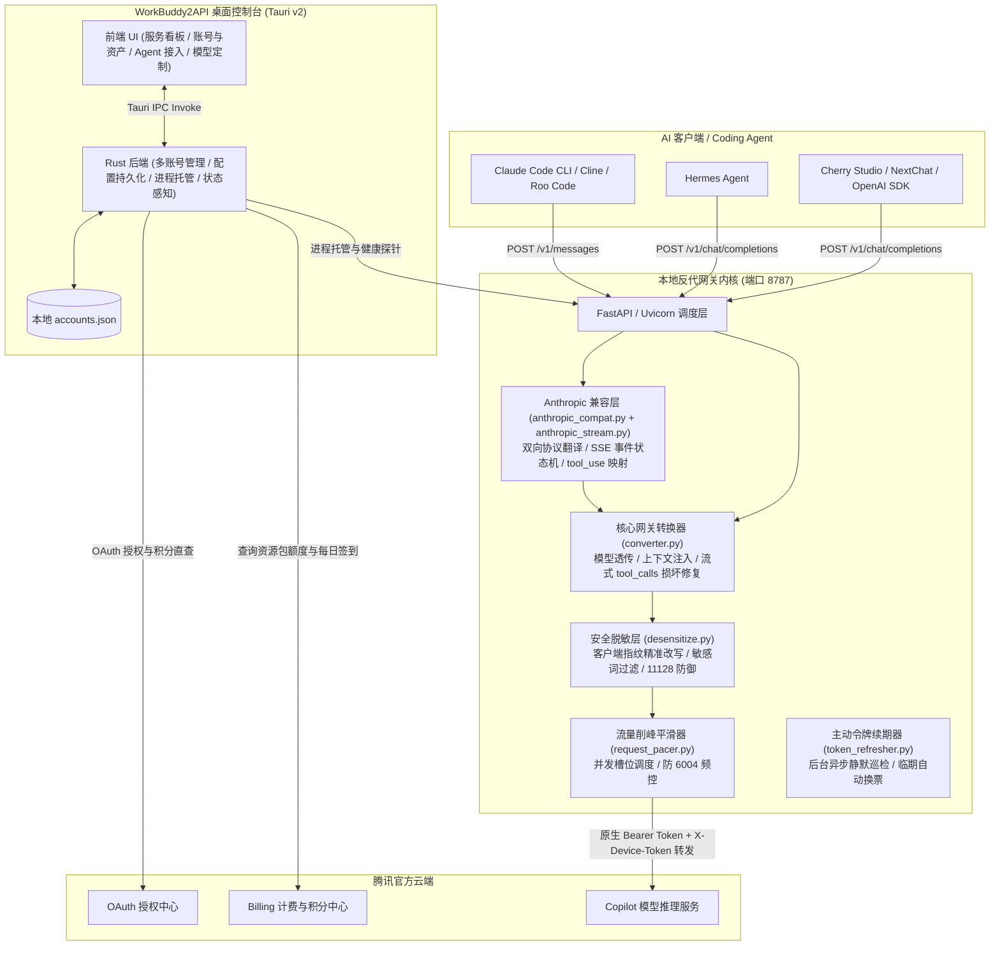

<div align="center">

# 🚀 WorkBuddy2API

### 独立桌面控制台 · WorkBuddy 转 OpenAI / Anthropic / Responses 三协议 API 网关 · 多账号资产管理 · Coding Agent 接入引导

> **说明**：本项目原名 `codebuddy2openai`。随着架构全面升级并原生支持 **Anthropic Messages (`/v1/messages`)** 与 **OpenAI Responses (`/v1/responses`)** 协议，本项目已正式更名为 **WorkBuddy2API**，提供兼顾 OpenAI Chat、Responses 与 Anthropic 三大主流生态的统一本地 API 网关。

[](LICENSE)
[](https://github.com/3304711297/workbuddy2api)
[](#-核心接口与协议速查)
[](https://tauri.app/)
[](https://www.python.org/)

<p align="center">
  <b>无需下载或安装原版腾讯 WorkBuddy 客户端</b>，直接在浏览器中完成网页授权，<br/>
  将腾讯代码助手能力转换为标准的 <code>OpenAI (/v1/chat/completions)</code>、<code>Anthropic (/v1/messages)</code> 与 <code>Responses (/v1/responses)</code> 三协议接口，<br/>
  原生直连驱动 <b>Codex CLI</b>、<b>Claude Code CLI</b>、<b>Hermes Agent</b>、<b>Cline</b>、<b>Roo Code</b>、<b>Cherry Studio</b> 等各类主流 Coding Agent 与开发工具！
</p>

<p align="center">
  <i>A standalone Tauri v2 desktop console & local tri-protocol API gateway converting Tencent WorkBuddy / CodeBuddy subscriptions into standard OpenAI Chat, Anthropic Messages, and OpenAI Responses endpoints.</i>
</p>

<p align="center">
  <a href="#-30-秒极速上手-quick-start"><b>⚡ 30 秒极速上手</b></a> •
  <a href="#-界面与交互亮点-ui-preview"><b>🖥️ 界面预览</b></a> •
  <a href="#-核心特性矩阵"><b>✨ 核心特性</b></a> •
  <a href="#-安全隐私与信任声明-security--privacy"><b>🛡️ 安全与信任</b></a> •
  <a href="#-核心接口与协议速查"><b>🌐 接口速查</b></a> •
  <a href="#-english-overview"><b>📖 English</b></a>
</p>

</div>

---

## ⚡ 30 秒极速上手 (Quick Start)

本地服务默认监听 `http://127.0.0.1:8787`，启动应用后即可在各大开发工具与 CLI 中即配即用：

### 1. Claude Code CLI 官方直连
```bash
# macOS / Linux / Git Bash
export ANTHROPIC_BASE_URL="http://127.0.0.1:8787"
export ANTHROPIC_API_KEY="local"
claude

# Windows PowerShell
$env:ANTHROPIC_BASE_URL="http://127.0.0.1:8787"
$env:ANTHROPIC_API_KEY="local"
claude
```

### 2. Codex CLI (Responses 原生协议直连)
在 `~/.codex/config.toml` 中配置：
```toml
model = "deepseek-v3"
wire_api = "responses"
base_url = "http://127.0.0.1:8787/v1"
```

### 3. OpenAI 兼容客户端 (Hermes Agent / Cherry Studio / Cline / NextChat)
* **Base URL / 接口地址**：`http://127.0.0.1:8787/v1`
* **API Key / 鉴权密钥**：`local`（若在控制台设置了自定义密钥，请填写真实密钥）
* **支持模型**：动态获取当前账号全部可用模型（如 `deepseek-v3`, `deepseek-r1`, `claude-3-5-sonnet` 等）

---

## 🛡️ 安全、隐私与信任声明 (Security & Privacy)

面对逆向网关类工具，**凭据安全与隐私边界是第一生命线**：

1. 🔒 **100% 本地运行与存储，绝无云端中转**：
   * 所有授权 Token、Cookie 与会话凭据仅持久化保存在用户本机操作系统目录（`%LOCALAPPDATA%/workbuddy2api/accounts.json`）。
   * 绝不存在任何第三方中转代理、遥测上报或远程鉴权服务器，流量 100% 仅在「本机 ↔ 腾讯官方 Copilot 服务」之间发生。
2. 🛡️ **严格回环绑定与防跨站盗用守卫**：
   * 默认严格监听 `127.0.0.1`，拒绝公网暴露。
   * 内建 **Host + Origin 双校验守卫中间件**，彻底防御恶意外网网页发起的跨站请求（CSRF）与 DNS Rebinding 盗刷额度；开启局域网共享时**强制要求 CSPRNG 32 位鉴权密钥**，无密钥拒绝启动。
3. 🔍 **日志与调试快照全自动脱敏**：
   * 结构化日志与 API 调试快照中，所有请求的 Token、Session 和密钥均经过自动掩码处理（自动替换为 `***`）。
   * 明文 Payload（完整 Prompt / 响应正文）落盘默认**永久关闭**，开启需 Trace 级别与安全确认双重闸门。
4. 📜 **纯粹的 MIT 宽松开源协议**：
   * 源代码完全开放，架构解耦且包含覆盖三端的 900+ 项自动化契约测试，行为清晰透明，无任何恶意后门。

<details>
<summary><b>⚙️ 查看 Turing Shield SDK 与高级运行环境加固机制</b></summary>

* **WSL 宿主凭据穿透**：在 Linux / WSL 环境下运行时，自动探测并挂载 Windows 宿主已登录的桌面端凭据与多账号配置，免参数无感工作。
* **流式 tool_calls 损坏防御**：针对上游在 `stream=true` 且模型生成 `tool_calls` 时偶发分片损坏的问题，内核内建聚合校验与自动损坏重试，避免 Agent 死循环。
* **Turing Shield SDK 搜索范围**：
  1. 环境变量 `WORKBUDDY_TURING_SDK_DIR`（用户显式指定，最高优先级）；
  2. 系统用户目录（`%LOCALAPPDATA%`, `%APPDATA%`, `%ProgramFiles%` 等）下的官方安装目录（严格特征校验：`index.cjs` + 原生模块与 turing 标识）；
  3. **磁盘根目录（如 `D:\WorkBuddy`）默认不扫描**（防恶意伪造 SDK 注入）。非常规路径请使用 `setx WORKBUDDY_TURING_SDK_DIR "D:\workbuddy"` 显式放行。

</details>

---

## 🖥️ 界面与交互亮点 (UI Preview)

> 💡 **提示**：控制台采用现代极客深色设计（Dark Geek IDE Aesthetic），配备呼吸状态灯、微高光立体卡片与原生 SVG 动态数据图表。

| 模块 | 视觉与能力亮点 |
| :--- | :--- |
| **资产与多账号看板** | 实时逆向官方计量接口，呈现真实积分余额、资源包到期进度条与 **「🌙 夜间限免中」** 动态感知徽章 |
| **多账号调度矩阵** | 支持 **按到期日分层调度**（先烧快过期的额度）、Failover（遇 429 毫秒级静默切号重试）与轮询负载均衡 |
| **原生用量分析下钻** | 4h / 24h / 今日 / 7d 多档时间切片，零外部依赖手写 SVG 趋势图，支持按模型、时延与成败全链路下钻 |
| **内置 API 调试台** | 最近 200 条请求快照下钻回溯，支持一键参数回填重放与脱敏 curl 命令复制导出 |

---

## ✨ 核心特性矩阵

### 🔄 原生三协议全兼容 (Tri-Protocol Engine)
* **OpenAI Responses 协议 (`POST /v1/responses`)**：原生直连 **Codex CLI**（`wire_api="responses"`）与 OpenCode；完整承载流式语义事件状态机、`sequence_number` 等规范字段与多模态 Data-URI；内置可选长上下文最小语义闭包投影压缩（`--optimize-context`）。
* **Anthropic Messages 协议 (`POST /v1/messages`)**：双向协议翻译与流式 SSE 状态机，原生驱动官方 **Claude Code CLI**、Cline、Roo Code，完整支持流式与 `tool_use` 函数调用。
* **OpenAI 对话补全协议 (`POST /v1/chat/completions`, `GET /v1/models`)**：完整支持标准流式 SSE 与原生 Tools 函数调用，兼容 Hermes Agent、Cherry Studio、NextChat 等各类智能体。
* **DeepSeek 思维链开关注入与多轮一致性回填**：自动对 DeepSeek 模型注入 `thinking: {"type": "enabled"}` 与 effort 档位，多轮历史自动补齐占位，根除上游 `11133 model_param_invalid` 报错。

### 🔀 智能多账号调度与资产治理
* **到期日优先分层调度**：自动按日粒度识别各账号资产最早到期日，优先消耗临期额度，杜绝资产临期作废；同档账号平均轮换，未标记账号兜底。
* **智能故障转移 (Failover)**：遇 429 频控或 6004 限制时毫秒级自动切号重试；支持「账号 + 模型」维度的账号级独立冷却。
* **动态热加载**：调度策略与配置运行时热读 `settings.json`，GUI 修改后**免重启内核即刻生效**。
* **夜间限免与资产感知**：自动识别 `23:00–08:00` 官方限免时段并展示专属徽章；实时汇总自然日今日请求量、Token 消耗与频控次数。

### 📈 原生用量可观测性与调试台
* **多档时间范围切换**：用量页支持 4h / 24h / 今日 / 7d / 30d / 全部 六档切换，零依赖手写 SVG 趋势图表同步响应。
* **请求明细全链路下钻**：逐条记录时间、模型、结果、Token 与时延；失败行直接标注错误原因与重试链路，降级行给出完整模型转换链。
* **内置 API 调试台**：保留最近 200 条请求快照（数据脱敏安全落盘），支持一键参数回填重放与脱敏 curl 命令一键复制。

### 🛡️ 工程级安全脱敏与风控防御
* **流量削峰平滑器 (RequestPacer)**：内置并发槽位调度器与后台主动令牌续期器，削平脉冲并发防止触发上游 6004 频控。
* **客户端指纹脱敏改写**：精准改写 Claude Code 身份短语并剔除触发特征，彻底消除系统提示词误触发 11128 安全风控拦截。
* **413 超限熔断与多模态 Data-URI**：ASGI 块级累计超限（默认 16MB）秒级熔断；多模态图片自动异步下载并内嵌 Data-URI，配备严格 SSRF 校验。
* **User-Agent 规范仿真**：出站请求智能仿真官方客户端标识，规避非标 UA 触发 10085 拦截与使用端归因失真。

---

## 🌐 核心接口与协议速查

本地服务默认监听 `http://127.0.0.1:8787`，提供以下标准 API 与工具端点：

| 协议 / 功能分类 | 接口端点 | 适用客户端 / 场景 | 推荐鉴权 Header |
|---|---|---|---|
| **OpenAI Responses 协议** | `POST /v1/responses` | **Codex CLI**, OpenCode, Responses SDK | `Authorization: Bearer <key>` 或 `x-api-key: <key>` |
| **Anthropic Messages 协议** | `POST /v1/messages` | **Claude Code CLI**, Cline, Roo Code, Anthropic SDK | `x-api-key: <key>` 或 `Authorization: Bearer <key>` |
| **OpenAI 对话补全协议** | `POST /v1/chat/completions` | **Hermes Agent**, Cherry Studio, NextChat, OpenAI SDK | `Authorization: Bearer <key>` |
| **模型列表探测** | `GET /v1/models` | OpenAI 格式标准模型列表（动态拉取上游全部模型） | `Authorization: Bearer <key>` |
| **服务健康与探活** | `GET /health` | 本地健康检测 / 心跳探测（安全收窄，不泄露敏感身份信息） | 无需鉴权 |
| **用量统计与积分概览** | `GET /api/usage_summary` | 当前账号积分余额、今日用量（请求数/Token/429） | `Authorization: Bearer <key>` |
| **频控与冷却状态感知** | `GET /api/rate_limit` | 上游 6004 频控状态与冷却倒计时（三态感知） + 多账号调度配置来源（`rotation.config_source`） | `Authorization: Bearer <key>` |
| **11128 毒历史自查** | `POST /api/desensitize_check` | 干跑脱敏诊断：定位哪条 system/assistant 历史带客户端指纹（只报不改） | `Authorization: Bearer <key>` |
| **请求快照查询** | `GET /api/snapshots` | 最近请求快照（最新在前，调试 Tab 数据源） | `Authorization: Bearer <key>` |

---

<details>
<summary><h2>📐 系统架构与工作流（点击展开）</h2></summary>


```mermaid
flowchart TD
    subgraph Client [AI 客户端 / Coding Agent]
        Claude[Claude Code CLI / Cline / Roo Code]
        Hermes[Hermes Agent]
        Other[Cherry Studio / NextChat / OpenAI SDK]
    end

    subgraph Console ["WorkBuddy2API 桌面控制台 (Tauri v2)"]
        GUI["前端 UI (服务看板 / 账号与资产 / Agent 接入 / 模型定制)"]
        Core["Rust 后端 (多账号管理 / 配置持久化 / 进程托管 / 状态感知)"]
        DB[("本地 accounts.json")]
    end

    subgraph Proxy ["本地反代网关内核 (端口 8787)"]
        Server["FastAPI / Uvicorn 调度层"]
        AnthropicLayer["Anthropic 兼容层 (anthropic_compat.py + anthropic_stream.py)<br/>双向协议翻译 / SSE 事件状态机 / tool_use 映射"]
        Desensitize["安全脱敏层 (desensitize.py)<br/>客户端指纹精准改写 / 敏感词过滤 / 11128 防御"]
        Pacer["流量削峰平滑器 (request_pacer.py)<br/>并发槽位调度 / 防 6004 频控"]
        Refresher["主动令牌续期器 (token_refresher.py)<br/>后台异步静默巡检 / 临期自动换票"]
        Converter["核心网关转换器 (converter.py)<br/>模型透传 / 上下文注入 / 流式 tool_calls 损坏修复"]
    end

    subgraph Remote [腾讯官方云端]
        Auth[OAuth 授权中心]
        Meter[Billing 计费与积分中心]
        Copilot[Copilot 模型推理服务]
    end

    Claude -->|POST /v1/messages| Server
    Hermes -->|POST /v1/chat/completions| Server
    Other -->|POST /v1/chat/completions| Server

    GUI <-->|Tauri IPC Invoke| Core
    Core <--> DB
    Core -->|进程托管与健康探针| Server
    Core -->|OAuth 授权与积分直查| Auth
    Core -->|查询资源包额度与每日签到| Meter

    Server --> AnthropicLayer
    AnthropicLayer --> Converter
    Server --> Converter
    Converter --> Desensitize
    Desensitize --> Pacer
    Pacer -->|原生 Bearer Token + X-Device-Token 转发| Copilot
```

</details>

---

## 🚀 快速开始

### 方式一：直接运行桌面客户端（推荐）

双击桌面生成的 **`WorkBuddy2API`** 快捷方式，或直接运行编译产物：
```bash
src-tauri/target/release/workbuddy2api.exe
```

1. **授权登录**：进入「授权新账号」页面，点击开始授权，浏览器将自动唤起腾讯登录页，完成授权后客户端自动保存凭据并切到账号面板。
2. **启动服务**：在「服务看板」点击「启动服务」，本地将监听 `http://127.0.0.1:8787`。
3. **Agent 接入引导**：进入「Agent 智能体接入引导」页面，查看 Claude Code、Hermes 或 ZCode 的接入指南与推荐配置，按需复制到各客户端中使用。

---

### 方式二：本地构建与源码调试

#### 环境要求
- Node.js 20+（推荐 LTS 20 或 22+）与 npm
- Rust 1.77+ 与 Cargo
- Python 3.10+（需安装依赖 `httpx fastapi uvicorn[standard]`）

```bash
# 1. 克隆本项目
git clone https://github.com/3304711297/workbuddy2api.git
cd workbuddy2api

# 2. 安装前端依赖
npm install

# 3. 运行 Tauri 开发模式或构建 Release 版本（走已内置的 @tauri-apps/cli）
npm run tauri -- dev                     # 调试模式（自动编译并拉起桌面窗口）
npm run tauri -- build --no-bundle       # 仅编译 Release 可执行程序（产物：src-tauri/target/release/workbuddy2api.exe）
npm run tauri build                      # 完整构建（含 NSIS 独立安装包，产物在 src-tauri/target/release/bundle/nsis/）

# 亦可直接双击运行仓库自带的一键构建脚本：
.\build.cmd                              # 或 PowerShell 执行 .\build.ps1
```

> **提示**：若习惯使用 Cargo 原生 CLI，需先执行 `cargo install tauri-cli --version "^2"`，随后可在 `src-tauri` 目录下执行 `cargo tauri dev` 或 `cargo tauri build --no-bundle`。

---

## ⚙️ 模型支持说明

支持的模型清单**自动获取 WorkBuddy 支持的全量模型**：启动服务后，控制台「模型与接口」页面会自动从 WorkBuddy 官方后端拉取模型矩阵，包含每个模型的计费倍率、上下文窗口上限与思考强度档位，并支持在页面内定制（修改上下文窗口、调节/关闭思考强度）。

- **双协议透明支持**：无论是 OpenAI 端点（`/v1/chat/completions`）还是 Anthropic 端点（`/v1/messages`），均可直接使用相同的模型标识（如 `glm-5.3-flash`、`deepseek-v4.1-flash`、`kimi-k2.7` 等），网关会自动完成参数规格适配。
- 模型集合随上游动态变化，本文档不再维护静态清单；以控制台「模型与接口」页面实时展示的列表为准。

---

## 💻 开发者 SDK 与 cURL 调用示例

### 1. Python (Anthropic SDK)
```python
import anthropic

# 指向本地 WorkBuddy2API 的 Anthropic Messages 端点
client = anthropic.Anthropic(
    base_url="http://127.0.0.1:8787",
    api_key="local"
)

message = client.messages.create(
    model="glm-5.3-flash",
    max_tokens=1024,
    messages=[
        {"role": "user", "content": "你好，请用 Python 写一个支持并发的安全队列。"}
    ]
)

print(message.content[0].text)
```

### 2. Python (OpenAI SDK)
```python
from openai import OpenAI

# 本地 WorkBuddy2API 的 OpenAI 兼容端点
client = OpenAI(
    base_url="http://127.0.0.1:8787/v1",
    api_key="local"
)

response = client.chat.completions.create(
    model="glm-5.3-flash",
    messages=[
        {"role": "user", "content": "你好，请用 Python 写一个支持并发的安全队列。"}
    ],
    temperature=0.7
)

print(response.choices[0].message.content)
```

### 3. cURL 命令行调用
```bash
# Anthropic Messages 接口
curl -X POST http://127.0.0.1:8787/v1/messages \
  -H "x-api-key: local" \
  -H "anthropic-version: 2023-06-01" \
  -H "Content-Type: application/json" \
  -d '{"model": "glm-5.3-flash", "max_tokens": 512, "messages": [{"role": "user", "content": "Hello!"}]}'

# OpenAI Chat Completions 接口
curl -X POST http://127.0.0.1:8787/v1/chat/completions \
  -H "Authorization: Bearer local" \
  -H "Content-Type: application/json" \
  -d '{"model": "glm-5.3-flash", "messages": [{"role": "user", "content": "Hello!"}], "stream": false}'
```


---

## 📖 English Overview

**WorkBuddy2API** is a high-craft local API gateway and desktop console (powered by Tauri v2) that converts Tencent WorkBuddy / CodeBuddy subscriptions into standard AI interfaces.

### Key Highlights
- **Tri-Protocol Support**: Seamlessly translates upstream endpoints into standard **OpenAI Chat** (`/v1/chat/completions`), **Anthropic Messages** (`/v1/messages`), and **OpenAI Responses** (`/v1/responses`).
- **Direct Agent Integration**: Natively drives **Claude Code CLI**, **Codex CLI**, **Hermes Agent**, **Cline**, **Roo Code**, and other coding assistants with streaming SSE, reasoning tokens, and tool-call auto-healing.
- **Zero Official Client Dependency**: Standalone browser OAuth polling flow allows logging in without having the official desktop client installed.
- **Intelligent Multi-Account Scheduler**: Tiered scheduling prioritizing earliest-expiring tokens, automatic failover on 429/6004 limits, and round-robin load distribution.
- **Strict Local Security**: 100% offline local credential storage (`%LOCALAPPDATA%/workbuddy2api`), Origin & Host CSRF/DNS-rebinding guards, and CSPRNG-generated Bearer key support.
- **Zero-Dependency Observability**: Native SVG usage charts, token rate-limit countdown monitors, and built-in interactive API replay console.

### Quick Start
```bash
# Claude Code CLI
export ANTHROPIC_BASE_URL="http://127.0.0.1:8787"
export ANTHROPIC_API_KEY="local"
claude

# OpenAI Compatible (Base URL)
http://127.0.0.1:8787/v1
```

---

## 🤝 致谢与生态溯源 (Credits & Inspirations)

本项目基于 [HanHan666666/codebuddy2openai](https://github.com/HanHan666666/codebuddy2openai) 进行深度二次开发与架构重构，架构设计深度借鉴了优秀开源项目 [EasyCLIProxyAPI](https://github.com/router-for-me/EasyCLIProxyAPI) 的桌面端实践思路。

同时，以下特性吸收了社区核心开源成果的智慧：
* **设备风控头注入与空 delta 清洗**：借鉴 [xiaofan6ya/workbuddy2api](https://github.com/xiaofan6ya/workbuddy2api) 与 [DistPub/workbuddy2api](https://github.com/DistPub/workbuddy2api)（MIT）。
* **Claude 指纹精准改写与多账号轮换**：借鉴 [IceeAn/codebuddy2api](https://github.com/IceeAn/codebuddy2api)（MIT）。

<details>
<summary><b>📋 点击展开社区开源生态借鉴与技术溯源清单（10+ 衍生项目明细）</b></summary>

| 借鉴 / 延续来源 | 协议 | 引入的设计思路与架构实践 |
| :--- | :--- | :--- |
| [ShouZhuo0413](https://github.com/ShouZhuo0413/codebuddy2api) · [hawklithm](https://github.com/hawklithm/workbuddy2api) | MIT | OpenAI Responses 协议原生端点 (`POST /v1/responses`) 请求响应状态机设计 |
| [momo0410](https://github.com/momo0410/workbuddy-switch-gateway) · [iuuuuuuuu](https://github.com/iuuuuuuuu/workbuddy-switch-gateway) | MIT | 按积分到期日（日粒度）分层选号调度机制，优先消耗临期额度 |
| [linguo2625469](https://github.com/linguo2625469/workbuddy2api-panel) · [HanawaBanana](https://github.com/HanawaBanana/workbuddy2api) | MIT | 413 请求体超限安全防护，ASGI 块级累计秒级熔断守卫 |
| [ardeyouxipianyi](https://github.com/ardeyouxipianyi/workbuddy2api-hub) · [turbomind66](https://github.com/turbomind66/workbuddy2api-python) | MIT | 官方客户端 User-Agent 规范仿真与动态自定义机制 |
| [xiaofan6ya](https://github.com/xiaofan6ya/workbuddy2api) | MIT | HTTP 200 内嵌错误识别拦截、14003 瞬时模型级限流秒级短冷却策略 |
| [orangeboyChen](https://github.com/orangeboyChen/codebuddy2api) | MIT | 客户端用量提示剥离、Anthropic 内置 system 角色保真与尾部占位兜底 |
| [neipor](https://github.com/neipor/codebuddy-cli2api) | MIT | 多模态远程图片异步下载内联转 Data-URI 与严格 SSRF 安全校验 |

</details>

> ⚠️ **免责声明**：本工具仅供个人学习、技术研究与工作流效率提升使用，请妥善保管个人授权凭据，遵循腾讯云相关产品服务协议。

---

## 📄 开源许可证

本项目基于 [MIT License](LICENSE) 开源。第三方开源代码与移植说明详见 [THIRD_PARTY_NOTICES.md](THIRD_PARTY_NOTICES.md)。
